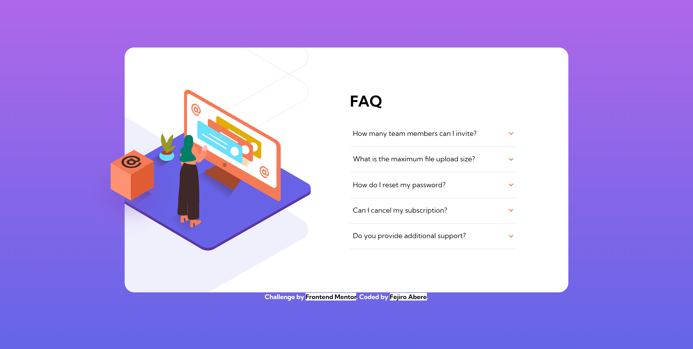

# Frontend Mentor - FAQ accordion card solution

This is a solution to the [FAQ accordion card challenge on Frontend Mentor](https://www.frontendmentor.io/challenges/faq-accordion-card-XlyjD0Oam). Frontend Mentor challenges help you improve your coding skills by building realistic projects.

## Table of contents

- [Overview](#overview)
  - [The challenge](#the-challenge)
  - [Screenshot](#screenshot)
  - [Links](#links)
- [My process](#my-process)
  - [Built with](#built-with)
  - [What I learned](#what-i-learned)
  - [Continued development](#continued-development)
  - [Useful resources](#useful-resources)
- [Author](#author)

## Overview

### The challenge

Users should be able to:

- View the optimal layout for the component depending on their device's screen size
- See hover states for all interactive elements on the page
- Hide/Show the answer to a question when the question is clicked

### Screenshot



### Links

- Solution URL: [Add solution URL here](https://your-solution-url.com)
- Live Site URL: [Add live site URL here](https://your-live-site-url.com)

## My process

### Built with

- Semantic HTML5 markup
- CSS custom properties
- Flexbox
- CSS Grid
- Mobile-first workflow

### What I learned

An ARIA accessible accordion:

```html
<div class="accordion">
  <h2>
    <button
      type="button"
      id="accordion-button--0"
      class="accordion-button"
      aria-expanded="false"
      aria-controls="accordion-panel--0"
    >
      <span>How many team members can I invite?</span>
      
    </button>
  </h2>
  <div
    role="region"
    id="accordion-panel--0"
    class="accordion-panel hidden"
    aria-labelledby="accordion-button--0"
  >
    <p>
      You can invite up to 2 additional users on the Free plan. There is no
      limit on team members for the Premium plan.
    </p>
  </div>
</div>
```

Display and hide an accordion content when the button is clicked/focused on

```css
.hidden {
  display: none;
  opacity: 0;
}

.accordion h2:has(> .accordion-button:focus) + .hidden {
  display: block;
  opacity: 1;
  animation: slideout 500ms ease-out;
}
```

Modification of aria-expanded for accessibility when element is focused on and when its not.
```js
"use strict";
const accordionButtons = document.querySelectorAll(".accordion-button");

accordionButtons.forEach((accordionButton) => {
  accordionButton.addEventListener("focus", function () {
    accordionButton.setAttribute("aria-expanded", true);
  });

  accordionButton.addEventListener("blur", function () {
    accordionButton.setAttribute("aria-expanded", false);
  });
});
```

### Continued development

Finding alternative ways to use CSS instead of JavaScript for some functions and make websites more accessible.

### Useful resources

- [My favourite accessible accordion pattern](https://www.hassellinclusion.com/blog/accessible-accordion-pattern/) - Alternative and accessible way to create an FAQ accordion
- [Accordion Example](https://www.w3.org/WAI/ARIA/apg/patterns/accordion/examples/accordion/) - Alternative and accessible way to create an FAQ accordion
- [Element: focus event](https://developer.mozilla.org/en-US/docs/Web/API/Element/focus_event) - focus and blur event on an element
- [Usage of :has pseudo-class](https://stackoverflow.com/questions/1014861/is-there-a-css-parent-selector) - using the :has pseudo class to select an element that has focus

## Author

- Frontend Mentor - [@Fejiro001](https://www.frontendmentor.io/profile/Fejiro001)
- Twitter - [@aberefejiro](https://www.twitter.com/aberefejiro)

